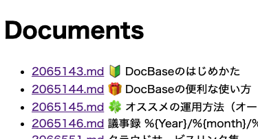
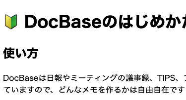

docbaseview
===========

DocBase でエクスポートしたファイルをローカルなどで閲覧するためのツールです。




DocBase でエクスポートをリクエストすると、以下の 3 つの zip ファイルをダウンロードできるので、取得しそれぞれフォルダに展開します。

- Markdown
- イメージ
- ファイル

展開したフォルダは、それぞれ以下の名前にリネームしてください。なお、リネームしない場合はコマンドライン引数で指定することもできます。

- **md** - Markdown
- **img** - イメージ
- **file** - ファイル

Go ツールチェイン (1.18 以上) が手元にあれば、以下のようにすることでサーバーを起動できます。サーバーはデフォルトでポート 8080 を待ち受けます。

```bash
go run .
```

フォルダ名が異なる場合は、以下のようにして起動します。

```bash
go run . -m <MD_DIR> -i <IMG_DIR> -f <FILE_DIR>
```

待ち受けるポートを変更するには、以下のようにして起動します。

```bash
go run . -p 4000
```

Basic 認証をかける機能を有効にするには、以下のようにして起動します。
なお、もし Basic 認証をかけてインターネットに公開することを考えている場合は、必ず HTTPS 経由で利用するようにしてください。

```bash
go run . -bu <USER> -bp <PASSWORD>
```

## 対応済機能

- 文書間のリンク
- 画像リンクの読み替え
- ファイルリンクの読み替え

## 未対応の機能

いまのところ、以下の機能には対応していません。

- PlantUML や Mermaid の描画
- ソースコードの構文ハイライト
- 画像のサイズ指定
- `:emoji:` 形式の絵文字の描画 (ただしごく一部の絵文字のみ実験的に対応)
- ファイルアイコンの描画 (固定のファイルを示す絵文字に変換されます)

その他ここに挙げられていない様々な機能が未対応である可能性があります。

## LICENSE

[The 3-Clause BSD License](LICENSE)

## Author

[mikan](https://github.com/mikan)
